# Diedro

## Leminiscata

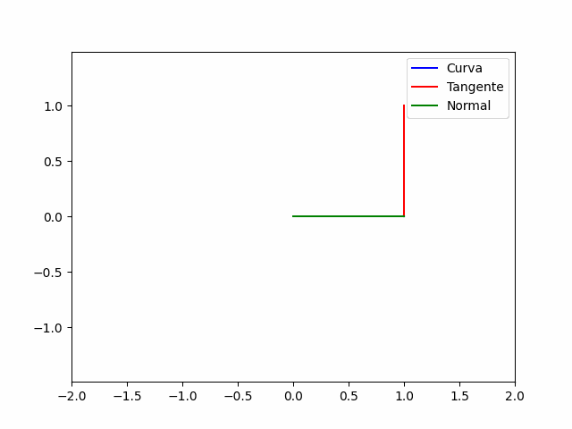

## Espiral Equiangular

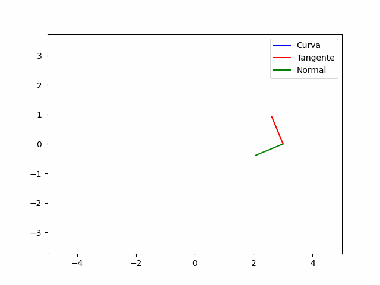

## Double Folium

## Astroide

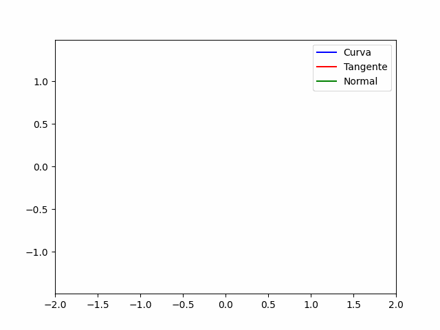

## Círculo

## Cardióide

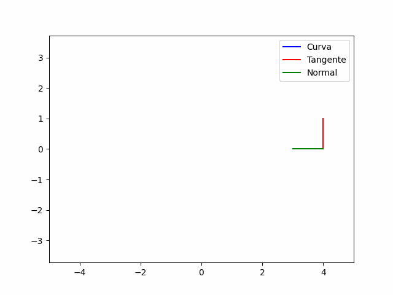

## $(\cos(2t), \sin(t))$

,sint)Diedro.gif)

# Triedro

## Helicóide

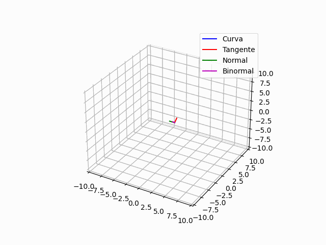

## $(\cos(2t), \sin(t), t)$

,sint,t)Triedro.gif)

## $(2(1+\cos(t))\cos(t),2(1+\cos(t))\sin(t)),t)$

.gif)

## Equiangular com z = t

.gif)

## Espiral com z = t

.gif)

# Cruvas Reconstruídas

## Vetor Tangente

### Cardióide

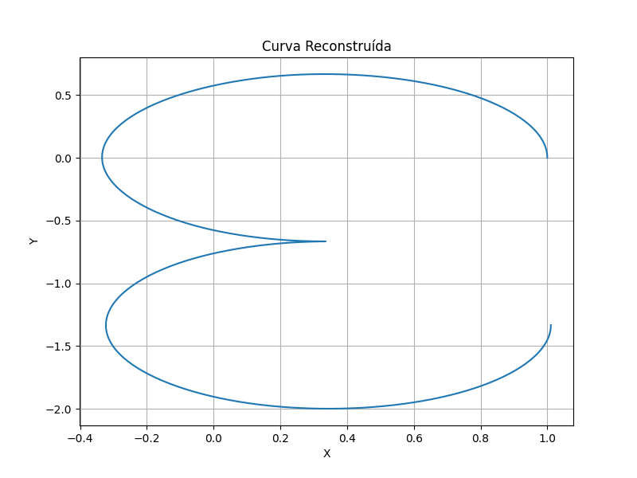

### Double Foiulium

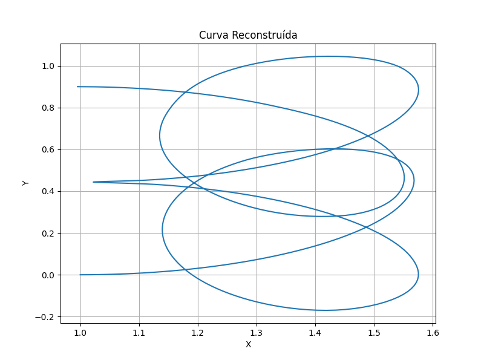

### $(\cos(2t),\sin(t))$

,sint).png)

### Astroide    

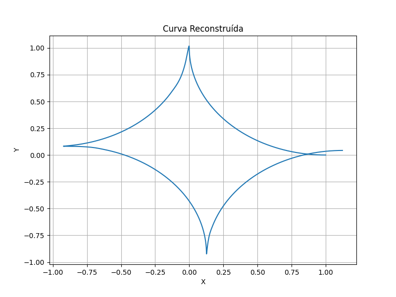

## Curvatura

### Cardioide

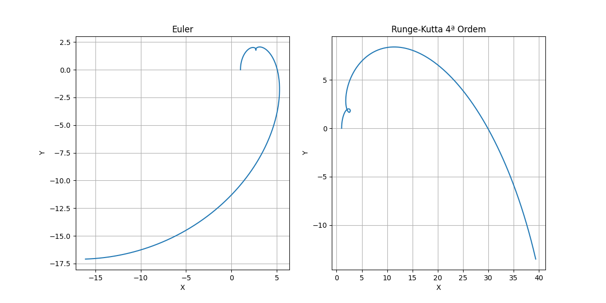

### Astroide

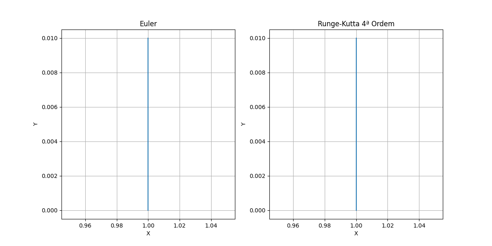

### $(\cos(2t),\sin(t))$

,sint).png)

### Circulo

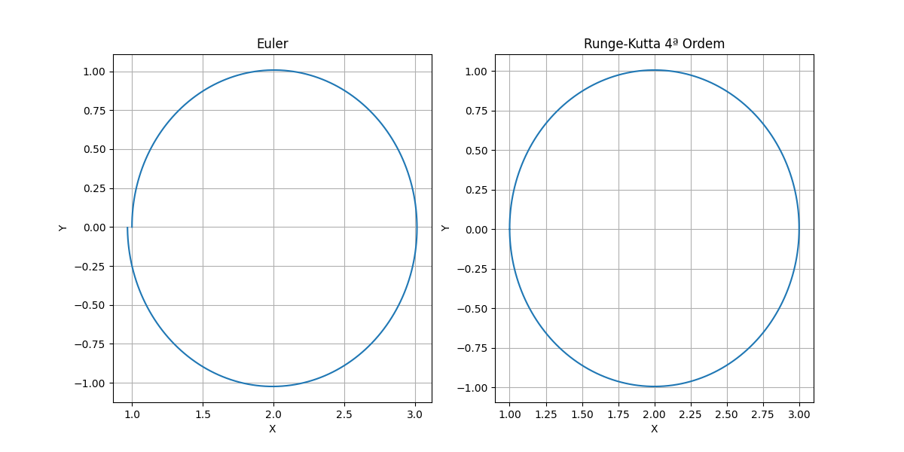

### Leminiscata

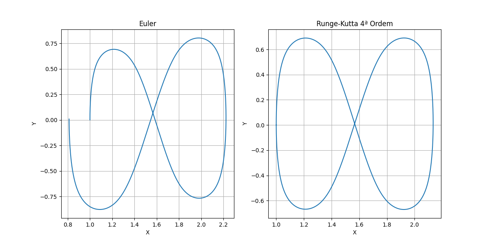